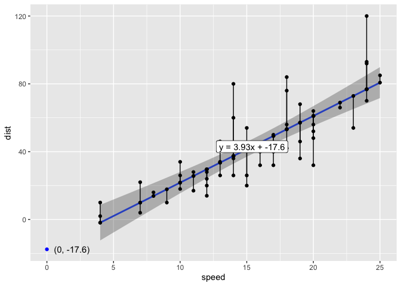
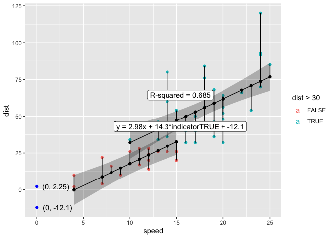
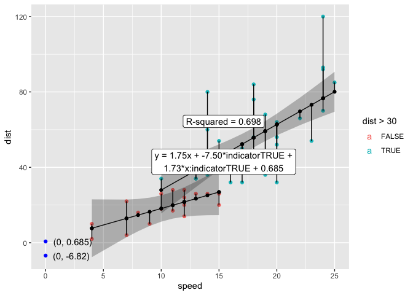
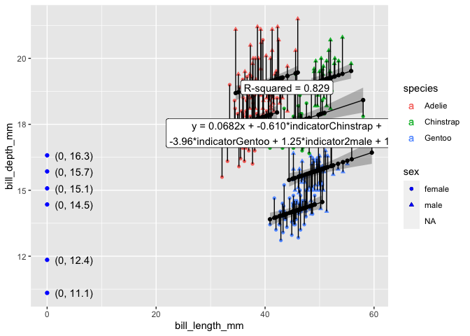
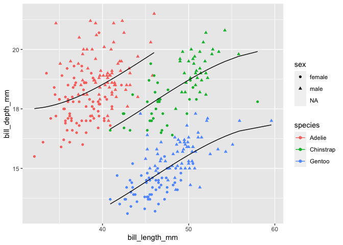

<!-- README.md is generated from README.Rmd. Please edit that file -->

# ggols

<!-- badges: start -->

<!-- badges: end -->

The goal of ggols is to …

## Installation

You can install the released version of ggols from
[CRAN](https://CRAN.R-project.org) with:

``` r
install.packages("ggols")
```

And the development version from [GitHub](https://github.com/) with:

``` r
# install.packages("devtools")
devtools::install_github("EvaMaeRey/ggols")
```

## ggxmean gives us all the geom\_lm\_\* functions

``` r
library(tidyverse)
#> ── Attaching packages ─────────────────────────────────────── tidyverse 1.3.0 ──
#> ✓ ggplot2 3.3.5     ✓ purrr   0.3.4
#> ✓ tibble  3.1.6     ✓ dplyr   1.0.8
#> ✓ tidyr   1.0.2     ✓ stringr 1.4.0
#> ✓ readr   1.3.1     ✓ forcats 0.5.0
#> ── Conflicts ────────────────────────────────────────── tidyverse_conflicts() ──
#> x dplyr::filter() masks stats::filter()
#> x dplyr::lag()    masks stats::lag()
library(ggxmean)

ggplot(cars) +
  aes(x = speed, y = dist,) +
  geom_point() +
  geom_lm() +
  geom_lm_intercept(color = "blue") +
  geom_lm_intercept_label(hjust = -.2) +
  geom_lm_conf_int() +
  geom_lm_residuals() +
  geom_lm_fitted() +
  geom_lm_formula() + 
  ggols:::geom_lm_rsquared() #should be moved to ggxmean
```



# Visualization, adding indicator var

``` r
library(ggols)
#> 
#> Attaching package: 'ggols'
#> The following objects are masked from 'package:ggxmean':
#> 
#>     geom_lm_indicator, good_digits

ggplot(cars) +
  aes(x = speed, y = dist, indicator = dist > 30,
  color = dist > 30) +
  geom_point() +
  geom_lm_indicator() +
  geom_lm_indicator_intercept(color = "blue") +
  geom_lm_indicator_intercept_label(hjust = -.2) +
  geom_lm_indicator_conf_int() +
  geom_lm_indicator_residuals() +
  geom_lm_indicator_fitted() +
  geom_lm_indicator_formula() +
  geom_lm_indicator_rsquared()
```



# Visualization, adding indicator interaction

``` r
ggplot(cars) +
  aes(x = speed, y = dist, indicator = dist > 30,
  color = dist > 30) +
  geom_point() +
  geom_lm_interaction() +
  geom_lm_interaction_intercept(color = "blue") +
  geom_lm_interaction_intercept_label(hjust = -.2) +
  geom_lm_interaction_conf_int() +
  geom_lm_interaction_residuals() +
  geom_lm_interaction_fitted() +
  geom_lm_interaction_formula() +
  geom_lm_interaction_rsquared()
```



# Visualization, and two indicator variables

``` r
ggplot(palmerpenguins::penguins) +
  aes(x = bill_length_mm, y = bill_depth_mm, 
      indicator = species, indicator2 = sex,
      color = species, shape = sex) +
  geom_point() +
  geom_lm_indicator2() +
  geom_lm_indicator2_conf_int() + 
  geom_lm_indicator2_residuals() +
  geom_lm_indicator2_fitted() +
  geom_lm_indicator2_formula() +
  geom_lm_indicator2_rsquared() +
  NULL
```


``` r

last_plot() + 
  geom_lm_indicator2_intercept(color = "blue") +
  geom_lm_indicator2_intercept_label(hjust = -.2)
```



``` r
ggplot(palmerpenguins::penguins) +
  aes(x = bill_length_mm, y = bill_depth_mm, 
      indicator = species, 
      color = species, shape = sex) +
  geom_point() +
  geom_lm_indicator(formula = y ~ I(x^3) + I(x^2) + x + indicator) 
```



``` r

# the implementation should change; curves expose problem. The non-smoothness shows prediction not made along parts not supported with data
```
