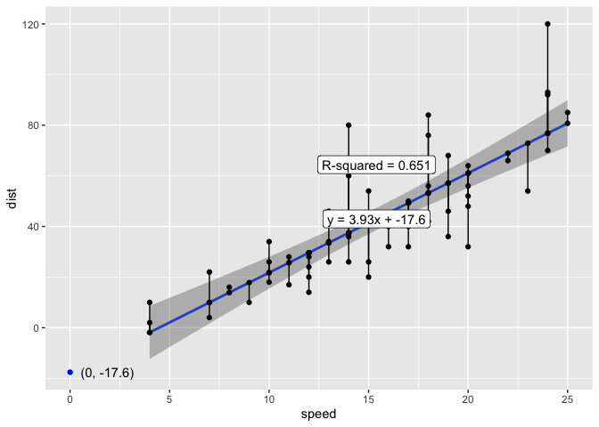
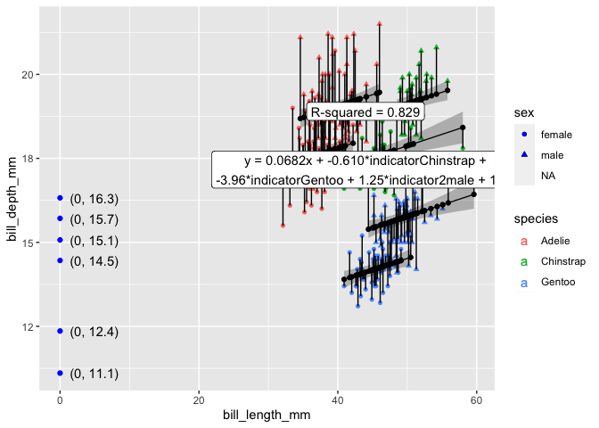

<!-- README.md is generated from README.Rmd. Please edit that file -->

# ggols

Statistical modeling is an important technique to understanding
relationships in data. In statistics classes, introductions to modeling
often start by modeling one continuous ‘response’ variable, y, by one
continuous ‘independent’ variable, x. After discussing statistical
features of this simple modeling set-up, students are then often
introduced to multivariate thinking in which a second explanatory
variable is used in modeling; most commonly, this second variable is an
cat or categorical variable, where conditions are discrete and
therefore easier to reason about.

Using the popular and powerful ggplot2 library, visualizations of models
with one explanatory variable is relatively straightforward via the
ggplot2::geom\_smooth() function. However, it is much more difficult to
use the ggplot2 package to visualize models with a second, categorical
prediction variable. geom\_smooth will indicate different predictions
for different categories when an categorical variable is included in the
aesthetic specification via for example aes(linetype = my\_cat) or
aes(color = my\_cat). However, the model estimation is performed
independently for each category; geom\_smooth is instructed to break
each dataset apart and compute group-wise. Compelling, 2-D visuals of
the models are possible, but challenging to choreograph with ggplot2.

The ggplot2 extension package {{ggols}} (from OLS) aims to provide new
geom\_\*’s that will allow for easy visualization of models of the form
y \~ x + z where x and y are continuous and z is discrete. The extension
strategy that is used is to specify that model computation happen at the
panel level (or maybe layer); and not the group level. In addition to
providing functionality like geom smooth, which allows for easy
visualization of a smear of model predictions and confidence intervals,
{{ggols}} also seeks to provide functions that allow for easy
visualization of other statistical quantities (like residuals,
prediction interval, intercepts, etc.)

<!-- badges: start -->

<!-- badges: end -->

The goal of ggols is to …

## Installation

You can install the released version of ggols from
[CRAN](https://CRAN.R-project.org) with:

``` r
install.packages("ggols")
```

And the development version from [GitHub](https://github.com/) with:

``` r
# install.packages("devtools")
devtools::install_github("EvaMaeRey/ggols")
```

## ggxmean gives us all the geom\_lm\_\* functions

``` r
library(tidyverse)
#> ── Attaching core tidyverse packages ──────────────────────── tidyverse 2.0.0 ──
#> ✔ dplyr     1.1.0     ✔ readr     2.1.4
#> ✔ forcats   1.0.0     ✔ stringr   1.5.0
#> ✔ ggplot2   3.4.1     ✔ tibble    3.2.0
#> ✔ lubridate 1.9.2     ✔ tidyr     1.3.0
#> ✔ purrr     1.0.1     
#> ── Conflicts ────────────────────────────────────────── tidyverse_conflicts() ──
#> ✖ dplyr::filter() masks stats::filter()
#> ✖ dplyr::lag()    masks stats::lag()
#> ℹ Use the conflicted package (<http://conflicted.r-lib.org/>) to force all conflicts to become errors
library(ggxmean)

ggplot(cars) +
  aes(x = speed, y = dist,) +
  geom_point() +
  geom_lm() +
  geom_lm_intercept(color = "blue") +
  geom_lm_intercept_label(hjust = -.2) +
  geom_lm_conf_int() +
  geom_lm_residuals() +
  geom_lm_fitted() +
  geom_lm_formula() + 
  ggols:::geom_lm_rsquared() #should be moved to ggxmean
```



# Visualization, adding cat var

``` r
library(ggols)
#> 
#> Attaching package: 'ggols'
#> The following objects are masked from 'package:ggxmean':
#> 
#>     geom_lm_cat, good_digits

ggplot(cars) +
  aes(x = speed, y = dist, cat = dist > 30,
  color = dist > 30) +
  geom_point() +
  geom_lm_cat() +
  geom_lm_cat_intercept(color = "blue") +
  geom_lm_cat_intercept_label(hjust = -.2) +
  geom_lm_cat_conf_int() +
  geom_lm_cat_residuals() +
  geom_lm_cat_fitted() +
  geom_lm_cat_formula() +
  geom_lm_cat_rsquared()
```


# Visualization, adding cat interaction

``` r
ggplot(cars) +
  aes(x = speed, y = dist, cat = dist > 30,
  color = dist > 30) +
  geom_point() +
  geom_lm_interaction() +
  geom_lm_interaction_intercept(color = "blue") +
  geom_lm_interaction_intercept_label(hjust = -.2) +
  geom_lm_interaction_conf_int() +
  geom_lm_interaction_residuals() +
  geom_lm_interaction_fitted() +
  geom_lm_interaction_formula() +
  geom_lm_interaction_rsquared()
```


# Visualization, and two cat variables

``` r
ggplot(palmerpenguins::penguins) +
  aes(x = bill_length_mm, y = bill_depth_mm, 
      cat = species, cat2 = sex,
      color = species, shape = sex) +
  geom_point() +
  geom_lm_cat2() +
  geom_lm_cat2_conf_int() + 
  geom_lm_cat2_residuals() +
  geom_lm_cat2_fitted() +
  geom_lm_cat2_formula() +
  geom_lm_cat2_rsquared() +
  NULL
```


``` r

last_plot() + 
  geom_lm_cat2_intercept(color = "blue") +
  geom_lm_cat2_intercept_label(hjust = -.2)
```



``` r
ggplot(palmerpenguins::penguins) +
  aes(x = bill_length_mm, y = bill_depth_mm, 
      cat = species, 
      color = species, shape = sex) +
  geom_point() +
  geom_lm_cat(formula = y ~ I(x^3) + I(x^2) + x + cat) 
```


``` r

# the implementation should change; curves expose problem. The non-smoothness shows prediction not made along parts not supported with data
```
